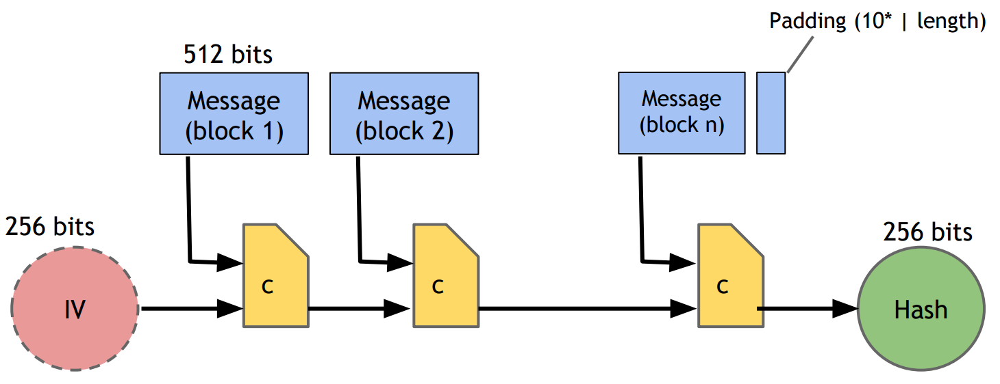
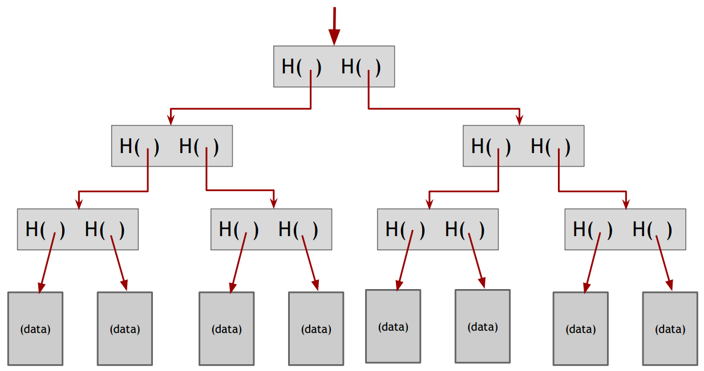
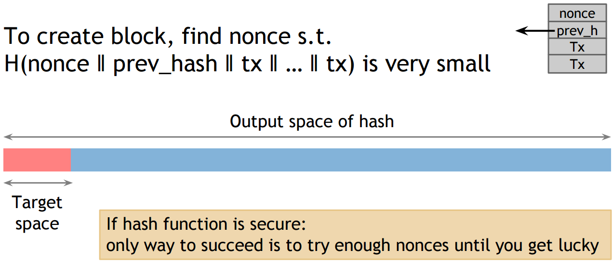
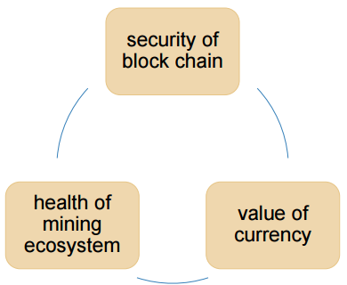
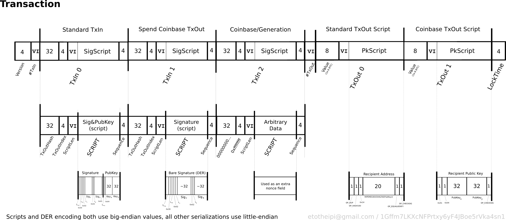

# Bitcoin and Cryptocurrency Technologies

This is my notes for auditing the course [*Bitcoin and Cryptocurrency Technologies*](https://www.coursera.org/learn/cryptocurrency/home) by Princeton University since 2017-02-20.
More resources [here](https://piazza.com/princeton/spring2015/btctech/resources).

## W1 - Intro to Crypto and Cryptocurrencies

### Cryptographic Hash Funcitons

- take any string as input
- fixed-size output
- efficiently computable

**Collision-free**: nobody *can* find `x` and `y` s.t. `x!=y` and `H(x)=H(y)` (collision do exists) - hash as a message digest

**Hiding**: given `H(x)` it is infeasible to find `x`; or if `r` is chosen from a high min-entropy distribution (very spread out), then given `H(r|x)` it is infeasible to find `x`

Commitment API:

- To seal *msg* in envelop: `(com, key) := commit(msg)`, then publish `com` - `(H(key|msg), key)` where `key` is a random 256-bit
- To open evelop: publish `key, msg`, anyone can `verify(com, key, msg) := (H(key|msg) == com)` to check validity

**Puzzle-friendly**: for every possible `y` if `r` is chosen from a high min-entropy distribution then it is infeasible to find `x` s.t. `H(r|x) = y`

- search puzzle: given `y` from high min-entropy and target-set `Y`, try to find `x` s.t. `H(y|x) \in Y`
- no solving strategy is much better than trying random values of `x`

[SHA-256](https://en.wikipedia.org/wiki/SHA-2)



#### Hash Pointers

> linked list with hash pointers = "block chain"

binary tree with hash pointers = "Merkle tree"



### Digital Signatures

API

```
(sk, pk) := generateKeys(keySize)
sig := sign(sk, msg)
isValid := verify(pk, msg, sig) // verify(pk, message, sign(sk, message)) == true
```

Bitcoin uses [Elliptic Curve Digital Signature Algorithm (ECDSA)](https://en.wikipedia.org/wiki/Elliptic_Curve_Digital_Signature_Algorithm) and more on [Elliptic Curve Cryptography](https://blog.cloudflare.com/a-relatively-easy-to-understand-primer-on-elliptic-curve-cryptography/).

#### Public Keys as Identities

`pk` says, "[msg]".

These identities are called "addresses" in Bitcoin.

## W2 - How Bitcoin Achieves Decentralization

Centralization vs. decentralization: decentralization is not all-or-nothing (e.g., email, decentralized protocol, but centralized webmail services)

> Bitcoin has three types of consensus: *value, state and rules.

1. Who maintains the ledger?
2. Who has authority over which transactions are valid?
3. Who creates new bitcoins?
4. Who determines how the rules of the system change?
5. How do bitcoins acquire exchange value?

#### Distributed consensus

> Bitcoin is a peer-to-peer system.

At any given time:

- All nodes have a sequence of blocks of transactions
they’ve reached consensus on
- Each node has a set of outstanding transactions it’s
heard about

*Why consensus is hard?* 

- Nodes may crash or may be malicious; network is imperfect
- [Byzantine Generals' Problem](https://en.wikipedia.org/wiki/Byzantine_fault_tolerance)
- [Paxos](https://en.wikipedia.org/wiki/Paxos_(computer_science)) protocals

*Bitcoin consensus works better in practice than in theory.*

- Introduces incentives
- Embraces randomness (consensus over long time)

#### Consensus without identity: the block chain

- Identity is hard in a P2P system — [Sybil attack](https://en.wikipedia.org/wiki/Sybil_attack)
- Pseudonymity is a goal of Bitcoin

:bulb: Implicit consensus

1. New transactions are broadcast to all nodes
2. Each node collects new transactions into a block
3. In each round a **random** node gets to broadcast its block
4. Other nodes accept the block only if all transactions in it are valid (unspent, valid signatures)
5. Nodes express their acceptance of the block by including its hash in the next block they create

#### Incentive 1: block reward

Creator of block gets to (the block has to end up on long-term consensus branch)

- include special coin-creation transaction in the block
- choose recipient address of this transaction

Value is fixed: currently 25 BTC, halves every 4 years (total *21 million* till 2040)

#### Incentive 2: transaction fees

- Creator of transaction can choose to make output value less than input value
- Remainder is a transaction fee and goes to block creator
- Purely voluntary, like a tip

#### Proof of work

Select nodes in proportion to computing power (let nodes compete for right to create block)



- difficult: as of Aug 2014 `~10^20` hashes/block
- parameterizable: nodes automatically re-calculate the target every two weeks `->` average time between blocks = 10 minutes
- trivial to verify: `nouce` published as part of the block and miners verify `H(nonce||prev_hash|| tx||...||tx) < target`

Mining economics: `block reward + Tx fees - mining cost = profit`

> Bitcoin is bootstrapped.



## W3 - Mechanics of Bitcoin

Field|	Description|	Size
---|---|---
Magic no|	value always 0xD9B4BEF9	|4 bytes
Blocksize|	number of bytes following up to end of block|4 bytes
Blockheader|	[6 fields](https://en.bitcoin.it/wiki/Block_hashing_algorithm)|	80 bytes
Transaction counter|	positive integer [VI = VarInt](https://en.bitcoin.it/wiki/Protocol_documentation#Variable_length_integer)|1 - 9 bytes
transactions|	the (non empty) list of transactions|`<Transaction counter>`-many transactions

[Bitcoin transcations](https://en.bitcoin.it/wiki/Transaction) (image from https://en.bitcoin.it/wiki)



Example Tx: [79de785f40d0797a53ef72b8986cfd426591b64b11f0c36cd8df1c652b109b30](https://blockchain.info/tx/79de785f40d0797a53ef72b8986cfd426591b64b11f0c36cd8df1c652b109b30) (randomly picked; alternative [explorer](https://blockexplorer.com/))

#### [Bitcoin Scripts](https://en.bitcoin.it/wiki/Script)

- Simple, compact
- Support for cryptography
- Stack-based
- Limits on time/memory
- No looping

### P2P Network

- Ad-hoc protocol (runs on TCP port 8333)
- Ad-hoc network with random topology
- All nodes are equal
- New nodes can join at any time
- Forget non-responding nodes after 3 hr

*Fully-validating nodes*

- Permanently connected
- Store entire block chain
- Hear and forward every node/transaction 
- Track the UTXO set (Unspent Transaction Output, everything else on disk)

*Thin/SPV clients (not fully-validating)*

- Store block headers only
- Request transactions as needed (to verify incoming payment)
- Trust fully-validating nodes
- 1000x cost savings

### Limitations 

Hard-coded limits in Bitcoin

1. 10 min. average creation time per block
2. 1 M bytes in a block (`>250` bytes/transaction  )
3. 20,000 signature operations per block
4. 100 M [*satoshis*](https://en.bitcoin.it/wiki/Satoshi_(unit)) per bitcoin
5. 21M total bitcoins maximum

Throughput limit: 1 M bytes/block (10 min) & `>250` bytes/transaction `->` 7 Txs/sec :disappointed:

Cryptographic limit: only 1 signature algorithm (ECDSA/P256)

- "Hard-forking" changes: old nodes will never catch up
	- New op codes
	- Changes to size limits
	- Changes to mining rate
	- Many small bug fixes
- Soft forks: add new features which only limit the set of valid transactions (need majority of nodes to enforce new rules), e.g. [Pay to script hash (P2SH)](https://en.bitcoin.it/wiki/Pay_to_script_hash)

## W4 - How to Store and Use Bitcoins

> How to store & use ~~bitcoin~~ secret key

* availability
* security
* convenience

**Bitcoin wallet** - A piece of software that remembers an individual's Bitcoin addresses and keys.

### Hot & cold storage

*Separate keys for separate bitcoins (addresses)*

- hot storage - online, convenient but risky (the wallet)
- cold storage - offline, archival but safe (the safe)

:bulb: *Hierarchical key generation*


What a paper wallet looks like (&copy; [bitcoinpaperwallet.com](https://bitcoinpaperwallet.com)):


:bulb: Key split & sharing - Split (share) secret into `N` pieces s.t. iff. given any `K` pieces can reconstruct the secret.

### Online Wallet, Exchange \& Payment

* Online Wallet (Services) - convenient, ideally run by security experts (https://bitcoin.org/en/choose-your-wallet)
* Bitcoin Exchanges - bank-like services `BTC <-> $` (https://blockchain.info/charts/market-price)
* Payment Services - merchants accepting BTC want `$`, *simple deployment* and *low risk (tech, security \& exchange-rate)*

> When you buy BTC, no transaction appears on the blockchain; the Exchange is just making a different promise.

Exchange's **Proof of Reserve** (independently verifiable using *Merkel-Tree*, no central regulator required):

- Prove that `>=x` amount of reserve currency 
- Prove that customers have `<=y` deposit
- So reserve fraction `>=x/y`

**Transcation Fee** `= value of inputs - value of outputs`

- goes to the miner recording the block (higher fee encourages faster relay \& record)
- concensus fee: 0.0001 BTC per 1000 bytes (no fee for some conditions)

Liquid Market (*supply vs demend* dynamic)

- Demend comes from:
	- fiat-currency transactions
	- investment
	- (arguably) paying transaction fee
- The equilibrium *price* `P = TD/S`
	- `T ($/sec)` total transcation value mediated via BTC 
	- `D (sec)` duration per transaction (almost fixed)
	- `S` supply of BTC excluding long-term investment (assumed fixed)

So `P` is proportional to `T` (\~ active transactions); but if more people prefer investment, price goes up as well .

Where to buy bitcoin :moneybag:

- online market: http://bitcoincharts.com/markets/
- p2p (https://localbitcoins.com/) and meetups

## W5 - Bitcoin Mining

Bitcoin mining in 6 steps:

1. Join the network, listen to all transactions (and validate them);
2. Maintain the blockchain (listen and validate new blocks);
3. Assemble a new valid block;
4. **Find the `nouce` to make your block valid;** (`~2^66` trials)
5. Hope everyone accepts your new block;
6. Profit!

Difficulty: *10min/block* (adopted every two weeks, see the [trend](https://bitcoinwisdom.com/bitcoin/difficulty)) 

### Hardwares \& Energy

- ~~CPU mining~~
- ~~GPU mining:~~
	- Goodput - worth over-clocking 50% with 30% errors
	- Poor utilization of hardware, poor cooling and power efficiency
- ~~[FPGA](https://en.wikipedia.org/wiki/Field-programmable_gate_array) mining~~
- Bitcoin ASICs ([application-specific integrated circuit](https://en.wikipedia.org/wiki/Application-specific_integrated_circuit))
	- e.g., TerraMiner IV since *Jan 2104*, `2 TH/s`, $6,000, ~14 months to find a block
	- most boards obsolete within 3~6 months (difficulty is dynamic based on total computation power) `->` **shipping is important**
	- Individuals should have lost money ... but bitcoin price is rising
- Professional mining centers (img &copy; [BitFury](http://bitfury.com/products#container-datacenter))


Energy:

- Embodied, electricity, cooling
- ~US$15,000/block (or 150~900MW electricity consumed)
- All (other) payment systems require energy
- Data fornaces `->` heater

### Strategies

Mining Pools \& Mining Shares

- Protocal, API, even hardware supports
- Pros: more predictable, good for small miners
- Cons: centralized, full nodes discouraged
- The [pools](https://bitcoinchain.com/pools)

Game-theoritic, strategic decisions:

- which transactions to include (*any above min tx fee*)
- which block to mine on top of (*longest valid chain*)
- how to choose between colliding blocks (*first heard*)
- when to announce a new block (*immediately after finding*)

> What you can do other than those default decisions?

- Forking attacks `->` crash exchange rate `->` destroy Bitcoin
	- enforce checking point
- Block-withholding (not announce immediately)
- Punitive-forking, feather-forking (blacklist tx from *X*, or negotiate tx fee)

> Miners are free to implement any strategy but little non-default behaviours in the wild so far.

## W6 - Bitcoin and Anonymity

`anonymity = pseudonymity + unlinkability`

Complete unlinkability is hard (only anomymity set)

* link different addresses of the same user
* link different transactions of the same user
* link sender of a payment to its recipient

Anonymity vs decentralization

* Interactive protocal with bank (e.g., blind signature) are hard to decentralize
* Decentralization often achieved via public traceability to enforce security

> Best practice: always receive at fresh address

* Application-layer de-anonymization
	- Shared spending is evidence of joint control ([An Analysis of Anonymity in the Bitcoin System](https://arxiv.org/abs/1107.4524) and its [blog](http://anonymity-in-bitcoin.blogspot.com/))
	- Change address - idioms of use ([A fistful of Bitcoins](http://cacm.acm.org/magazines/2016/4/200174-a-fistful-of-bitcoins/fulltext) and related  [blog](https://blog.acolyer.org/2017/02/20/a-fistful-of-bitcoins-characterizing-payments-among-men-with-no-names/))
* Network-layer de-anonymization (first node to infrom)

[Tor](https://www.torproject.org/) - anonymous communication (layered encryption)

- [Hidden services](https://www.torproject.org/docs/hidden-services.html.en) - silk road

### Mixing

- intermediary - online wallet requires trust
- delicated mixing services (no records \& identities, ~~laundry~~)
	- use a series of mixes (standard API)
	- uniform transactions (chunk size)
	- automated client
	- all-or-nothing fee
- currently no reputable delicated mix
- decentralized mixing - [CoinJoin](https://en.wikipedia.org/wiki/CoinJoin)
	- finding peers: using untrusted server
	- peer anonymity: routing
	- denial of service: *CoinShuffle* [pdf](https://petsymposium.org/2014/papers/Ruffing.pdf)
- high-level flows/patterns can be recognized - :bulb: *merge avoidance*

[**Zerocoin**](http://zerocoin.org/) - protocol-level mixing

- Cryptographic guaranteen of mixing (not Bitcoin-compatible)
- Extension of Basecoin (Bitcoin-like Altcoin)
- [Zero-knowledge proof](https://en.wikipedia.org/wiki/Zero-knowledge_proof): minting/commitment
- [*Zerocash*](http://zerocash-project.org/): without basecoin - ledger/blockchain merely records existance of transactions

System | Type | Attacks | Deployability |
---|---|---|---
Bitcoin|Pseudonymous|Tx graph analysis|Default
Single Mix|Mix|Tx graph analysis, bad mix|Usable today
Mix chain|Mix|Side channels, bad mixes/peers|Bitcoin-compatible
Zerocoin|Cryptographic mix|Side channel (possibly)|Altcoin
Zerocash|Untraceable|None|Altcoin, tricky setup

## W7 - Community, Politics, and Regulation

Consensus about:

- Rules - what's valid; protocols and formats `<-` *core developers*
- History - content on the blockchain `<-` *miners*
- Coins are valuable (any currency needs this) - [Tinkerbell effect](https://en.wikipedia.org/wiki/Tinkerbell_effect) `<-` investors, merchants, customers \& payment services

[Bitcoin Core Software](https://github.com/bitcoin/bitcoin) (*C++, MIT*) - the de facto rule book of *Bitcoin*

[Bitcoin Improvement Proposals](https://github.com/bitcoin/bips) - the process

If you don't like the rules, you have

- right to fork (more enpowering) `>` right to exit (centralized currencies)
- after a hard fork:
	- start an altcoin `->` co-exist nicely
	- start a fight: market share, "real Bitcoin"

Nobody/everybody controls Bitcoin. (But [Bitcoin foundation](https://bitcoinfoundation.org/) pays the core developers and talks to governments.)

[Cypherpunk](https://en.wikipedia.org/wiki/Cypherpunk) -> [*Bitcoin: A Peer-to-Peer Electronic Cash System*](https://bitcoin.org/bitcoin.pdf) 2008 by [*Satoshi Nakamoto*](https://en.wikipedia.org/wiki/Satoshi_Nakamoto), a yet unknown person.

### Governments

Untraceable digital cash 

- defeats capital controls (flowing in/out country) - counter-measure is to disconnect from fiat currency
- facilitates some crimes, when it's easier to move money around (e.g., *Silk-Road*)

Anti money-laundering - Know Your Customer (KYC), reporting transcations

> Regulation might be good.

Regulation can address the failure of market (e.g. [Lemons market](https://en.wikipedia.org/wiki/The_Market_for_Lemons), or [price fixing](https://en.wikipedia.org/wiki/Price_fixing))

- market-based approaches: seller reputation, warranties
- regulations
	- required disclosure, with penlaty for lying
	- quality standard with enforcement
	- required warranties with enforcement

[BitLicense](https://en.wikipedia.org/wiki/BitLicense) of New York came into effect on August 8, 2015.

## W8 - Alternative Mining Puzzles

Puzzle requirements:

- Cheap to verify
- Adjustable difficulty

ASIC resistant:

- Lower barrier to entry
- Prevent dominance

:bulb: Memory hard puzzle (performance gap between processor \& memory) `->`
[Scrypt](https://en.wikipedia.org/wiki/Scrypt)

- Constant time, memory tradeoff
- Most widely used alternative Bitcoin puzzle (also used in security, password-hashing)
	1. fill memory with random values
	2. read from the memory with random order
- disadvantages: require `N` steps and `N` memory blocks
- others:
	- [Cuckoo hashing cycles](https://en.wikipedia.org/wiki/Cuckoo_hashing#Cycle)
	- X11/Dash [wiki](https://en.wikipedia.org/wiki/Dash_(cryptocurrency)), [website](https://www.dash.org/x11/)

*Updates*: [AsicBoost](https://www.asicboost.com/) and its [problem](http://www.mit.edu/~jlrubin//public/pdfs/Asicboost.pdf)

Non-outsourceable puzzle - encouraging vigilante attacks (submit shares but discard/keep blocks)

> Large mining pools are a threat.

### Proof-of-Useful-Work

*Bitcoin mining is extreamly wasteful.*

- Recovering power
	- Natural choices `->` protein folding, searching aliens - but *who chooses the problem?* (the benefit must be a pure public good; so far limited)
	- [Primecoin](https://en.wikipedia.org/wiki/Primecoin) - finding large prime numbers (Cunningham chain)
- Recovering hardware
	- [Permacoin](https://en.wikipedia.org/wiki/Proof-of-Space#Permacoin) - storage based puzzle (proof-of-space)

### Proof-of-Stake "Virtual Mining"

Bitcoin mining has a unnecessary step -> spend money on power and equipment (the "actual" mining)

- lower overall costs
- stakeholder incentives - good stewards?
- no ASIC advantage
- 51% attack prevention

> Is there any security that can only be gained by consuming "real" resources?

Still open question, see the [news](http://virtualmining.com/).

## W9 - Bitcoin as a Platform

### Append-only Log

Secure timestamping (hash commitments)

- Proof of knowledge
- Proof of receipt
- Hash-based signature schemes
- ~~Proof of clairvoyance~~ (requires proving no multiple predictions)

Timestamping in Bitcoin

- public key `->` hash of data `->` unspendable UXTO
- [CommitCoin](https://eprint.iacr.org/2011/677.pdf), no UXTO but low data rate
- provably unspendable commitments (scripts) - not standard Tx, might poison the blockchain
- [Omni](http://www.omnilayer.org/) (formerly [MasterCoin](https://en.wikipedia.org/wiki/Mastercoin)) - overlay currency with more features/APIs

*Secure Multi-Party Lotteries* [pdf](https://eprint.iacr.org/2013/784.pdf)

Randomness (fair) and forced to pay `->` **timed** hash commitments

- Pros: implemented on Bitcoin
- Cons: `O(N^2)` with `MULTISIG` \& time-locked tx, also requires `bonds > bet`

### Smart Property

> Every Bitcoin* carries a history (thus not fungible).

[Colored coins](https://en.bitcoin.it/wiki/Colored_Coins) \& [Open Assets protocol](https://github.com/OpenAssets/open-assets-protocol) - metadata on Bitcoin

- stock certificates
- tickets
- ownership of domain names

### Public Randomness Protocal

Blockchain as a crytographic randomness beacon. `p(nonce) = 1/d and d > 2^66` - cost of manipulation: Bernoulli trials - discarding `1/p - 1` blocks (25 BTC) to achieve outcome with probability `p`

- Pros: fully decentralized, beacons every 10 min
- Cons: imprecise timing, delay to ensure no forks, might be to cheap for some application (e.g., NBA drafts)

:bulb: Built-in beacon support in script - add an opcode for a beacon call `->` simplified multi-party lotteries

### [Prediction Market](https://en.wikipedia.org/wiki/Prediction_market)

Assertions about the outside world - [Reality Keys](https://www.realitykeys.com/)

Decentralized order books - [Predictious](https://www.predictious.com/)

- submit orders to miners, let them match *any* possible trade
- spread is retained as a transaction fee (no front-running)

**Bitcoin is not enough.**

to build|-
|---|---|
payment|ok
settlement|no trades
arbitration|trusted arbiter only
order books|must be external

## W10 - Altcoins and the Cryptocurrency Ecosystem

[Altcoin](http://altcoins.com/) - Alternate cryptocurrencies, bitcoin alternatives

- Easy - fork, modify and announce
- Hard - bootstraping interest
	- pre-mine
	- pre-sale
	- proof-of-burn
	- airdrop ([Auroracoin](https://en.wikipedia.org/wiki/Auroracoin) story)
	- pump-and-dump cycle/attack
- Pros: competition leads to better system (new features)
- Cons: harm the whole cryptocurrency ecosystem (dividing mining power `->` weak security)

### History

Bitcoin `->` [Namecoin](https://namecoin.org/) (first fork) `->` 
667 currencies in total, 3 this month (updated 2017.4, see the [map](http://mapofcoins.com/bitcoin) for more)

[Market Capitalizations](https://coinmarketcap.com)| 20170416
---|---
Market Cap| $28,720,624,074
24h Vol| $397,871,692
BTC Dominance| 66.8%

- better/different security (mining puzzle)
- contract/platform features
- parameters & monetary policy
- community or common interest support

*Namecoin* - First altcoin (Apr. 2011), featured domain name registration ([wiki](https://en.wikipedia.org/wiki/Namecoin))

> Bitcoin frees money – Namecoin frees DNS, identities, and other technologies.

[*Litecoin* (LTC)](https://litecoin.org/) - merory-hard mining puzzle launched in Sep. 2011 ([core](https://github.com/litecoin-project/litecoin) in *C++*)

[*Peercoin*](https://peercoin.net/) (Aug. 2012) - first proof-of-stake algorithm (also uses regularly published "checkpoints")

[*Dogecoin*](http://dogecoin.com/) (Dec. 2013) - tipping, charity & sponsorship culture with *random block rewards* (removed Mar. 2014)

Comparison metrics

- Market cap `prcie * total #coins`
- Exchange volume
- Total hashpower
- Merchant support and usage

> Bitcoin and Altcoins compete and interact supportively and destructively.

Mining attacks - even a small mining pool on a large network (e.g. Bitcoin) can demolish a small altcoin.

*Merge mining* [spec](https://en.bitcoin.it/wiki/Merged_mining_specification)

Originarily, mining is exclusive - just include the *merkel root* of Altcoin block `scriptSig: alt header` (even without explicit support from Bitcoin)

- easier to recruit, but also cheaper for attackers
- many mining pools merge-mine serveral coins

[Atomic cross-chain swaps/trading](https://en.bitcoin.it/wiki/Atomic_cross-chain_trading) `BTC <-> LTC` - deposit, refund & reveal (neither or both tx complete)

Bitcoin to Altcoin

- "Grandfather": all BTC holders get one (no risk)
- Unilateral exchange: burn BTC, get ALT (full risk)

Side-chain

- Altcoins that hold Bitcoin in reverse (smooth Altcoin launch risk)
- Requires changes of Bitcoin to support (tx that describe Altcoin's validation rules)
- Could be merge-mined (or alternative puzzle)

## W11 - The Future of Bitcoin?

The block chain as a vehicle for decentralization - smart property

- Representation - how to encode complex tx into the block chain
- Atomicity - how to couple the actions of the various parties

Integration Route `#1` - directly on Bitcoin

- easy to deploy
- limited repr and atom

Route `#2` - embedding (colored coins, Mastercoin)

- complex repr plus security (of Bitcoin)
- limited scripting and atom, and unwanted tx

Route `#3` - side chains (merge mined)

- avoid polluting blockchain
- requires Bitcoin modification

Route `#4` - Altcoins

- [Ethereum](https://www.ethereum.org/)
	- general framework for ledger-based consensus
	- Turing-complete script
	- pay for miner computation using "gas"

Level of (de)centralization

- single mandatory intermediary
- multiple competing intermediaries (freedom to choose mediator; anyone can start a decentralized prediction market)
- "threshold" of intermediaries (2-out-of-3 escrow/`MULTISIG`)
- no intermediary (disintermidiation)

Improving security

- reputation
- escrow & dispute mediation
- atomic exchange
- trusted hardware

> Decentralize everything!

- Purely digital things
	- name mapping
	- storage
	- pay for proof
	- random number
	- lotteries
- Things can be represented digitally: currencies, stocks & other assets
- Property ownership and trade
- Complex contracts: crowd funding, financial derivatives
- Markets and auctions (decentralized matching by broadcasting partially completed tx to P2P network)
- Data feeds: allow arbiters to assert facts (big incentives to lie)
- Autonomous agents
- Exchanges
	- pairs of friend pre-declare debt willingness
	- triangular debt cancellation means actual settlement may be rare (*liquidity*)

decentralization|what|level|integration|security
---|---|---|---|---
smart property|property ownership & trading|disintermidiation|Bitcoin| atomity
decentralized prediction markets|prediction markets|competition|Altcoin| atomity
[StorJ](https://storj.io/)|file storage and retrieval| competition|Bitcoin|reputation
Zerocoin|mixing| disintermidiation|Altcoin| atomity
[Ripple](https://ripple.com/)| currency exchange|disintermidiation |Altcoin|transitive trust

*Update*: The great Bitcoin scaling problem - *BU vs. SegWit* [explained](https://cointelegraph.com/explained/bitcoin-scaling-problem-explained)
